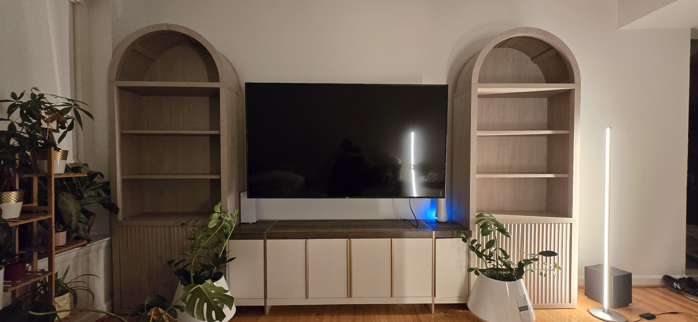

# Anderson Home Services

The website for my furniture assembly, move-in setup, drywall TV mounting, and light home services business in the Washington DC metro area.

**Live website:** https://andersonhomeservicesdmv.com



## About this project

I first prototyped the website on [Wix](https://caleb12235.wixsite.com/caleb1223). I then developed the custom-coded website iteratively with assistance from ChatGPT, Claude, and Codex, using my own business requirements, service descriptions, and project photos. It grew from single-page HTML prototypes into a ten-page static website. This repository records those saved code milestones and the current deployed source.

- Furniture assembly and larger move-in projects, with real project examples.
- Responsive layouts, keyboard navigation, native FAQ disclosures, and reduced-motion support.
- Page metadata, canonical URLs, structured business information, and a sitemap.
- Tally inquiry form with direct text/email alternatives.
- Plain-language service and privacy policies; no Google Analytics or advertising pixels in the current source.
- Automated checks for links, metadata, business hours, mobile overflow, keyboard behavior, and form loading/fallback.

## Reconstructed history

The Git history was reconstructed in September 2026 from saved HTML files and ZIP exports. It is not a record of the original keystrokes or original Git commits. Commit dates show when the reconstruction was made; source dates and hashes are documented in [the history guide](docs/HISTORY.md). Earlier snapshots may contain obsolete business terms, missing prototype assets, and old third-party links. Only the newest snapshot represents the current website.

## Live deployment and publishing

Cloudflare Pages project **andersonhomeservices-github** is connected to this repository's **main** branch. An approved push to main automatically builds and deploys the live website. Work on a separate branch and ask Caleb before publishing; see [release instructions](docs/PUBLISHING.md) and [agent instructions](AGENTS.md).

The build runs `node scripts/build-public.mjs` and publishes only `dist/`. Repository documentation, tests, dependencies, and Git history are excluded from the public website. The original Direct Upload project, **andersonhomeservices**, is retained for rollback.

The 37 public files at migration were byte-for-byte identical to the original production deployment **ac458254-c54e-48d1-aca1-cd7b310ccea7**. [Original deployment record and file hashes](docs/DEPLOYMENT.json). Subsequent deployment commits and status are visible in Cloudflare and GitHub.

## Local use and checks

Open index.html for a basic local preview. With Node.js and npm installed, run:

```sh
npm install
npx playwright install chromium
npm test
```

The normal test suite blocks third-party traffic. See [maintenance instructions](MAINTENANCE.md) for the optional read-only live Tally loading check. Submission tests are disabled because there is no separate test form. No tests submit customer inquiries.

## Files

Top-level HTML files contain the pages; assets/ contains shared styles, scripts, and images; tests/ contains browser checks. docs/ records provenance and the existing live deployment. Old ZIP bundles, unused standalone logo experiments, credentials, and client records are not included.

Business text, branding, and project photos are published for reference. No reuse license is granted by this repository.
